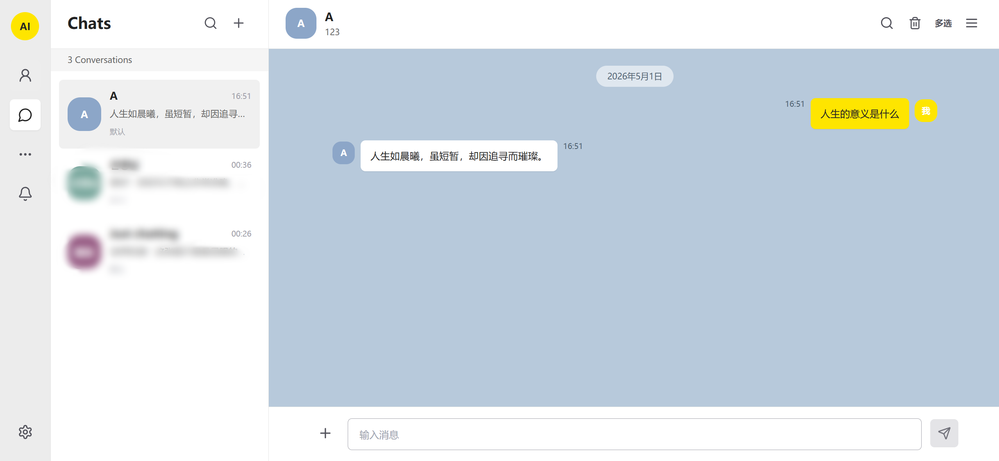
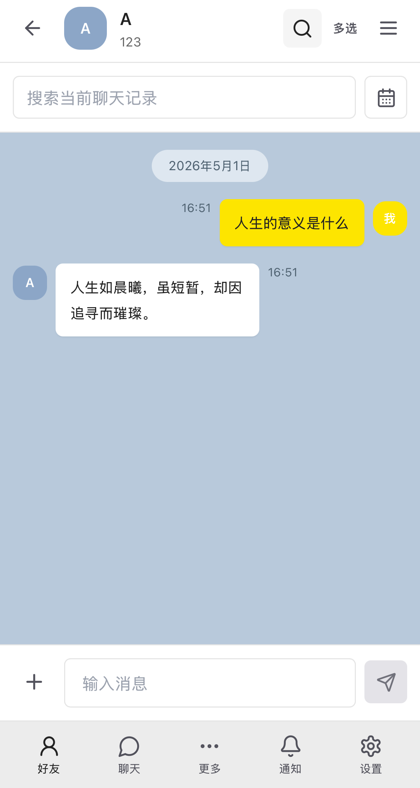
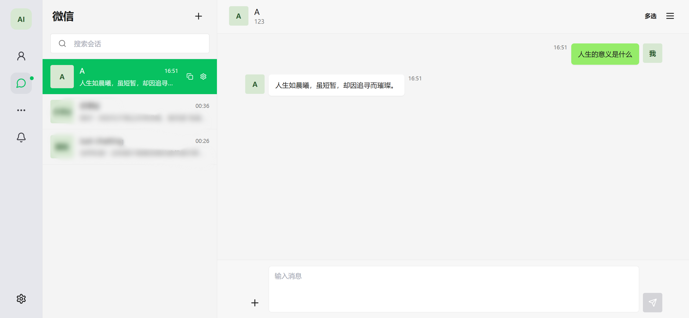
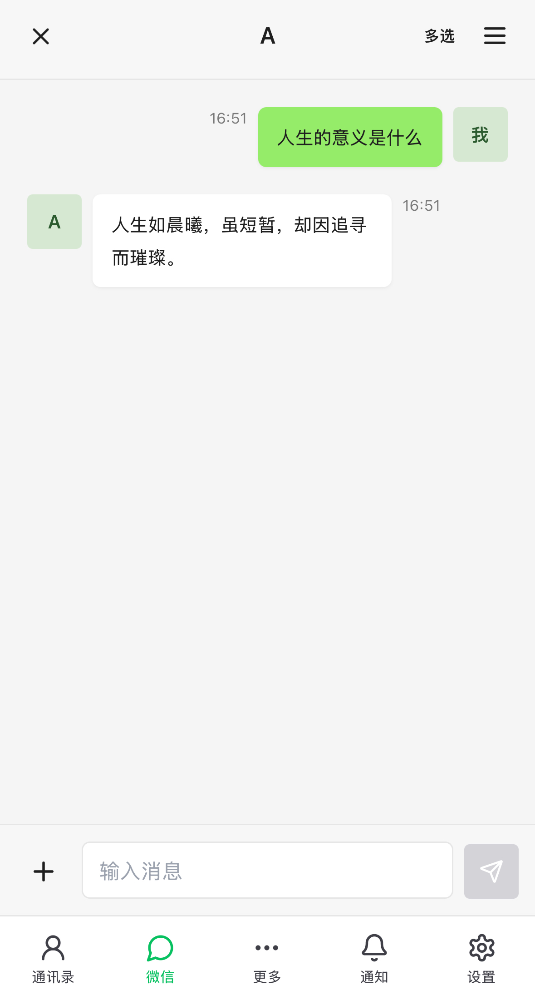

# Local AI Talk

React + Vite + Tailwind 制作的本地 AI 聊天客户端。

包含两套界面：

- KKT 风格：参照韩国通讯软件UI设计
- VX风格：就是微信风格

两套界面共用本地数据，支持联系人、人设、聊天记录、头像、图片、附件、导入导出。

## 预览图

### KKT 风格





### 微信风格




## 安装

```bash
npm install
```

## 本地运行

普通前端运行：

```bash
npm run dev
```

前端 + 本地 API 代理：

```bash
npm run dev:all
```

打开：

```text
http://localhost:5173
```

VX风格本地预览：

```bash
cd wechat-style-ai-chat
npm install
npm run dev
```

打开：

```text
http://localhost:5174
```

## API 设置

支持 OpenAI Compatible Chat Completions。

常见配置项：

```text
Provider Name
API Type
Request Mode
Base URL
API Key
Model
```

请求方式：

- 自动选择
- 浏览器直连
- 本地代理

NVIDIA 等接口建议使用本地代理，并运行：

```bash
npm run dev:all
```

## GitHub Pages

KKT 风格：

```text
https://tlsdid.github.io/local-ai-talk/
```

VX风格：

```text
https://tlsdid.github.io/local-ai-talk/wechat/
```

GitHub Pages 是静态网页，适合使用支持浏览器直连的接口。需要本地代理的接口请在本机运行。

## 功能

- 联系人管理
- 人设 prompt
- 独立聊天记录
- 全局 API 设置
- 联系人单独 API 设置
- 图片和附件
- 粘贴图片 / 文件
- 搜索聊天记录
- 聊天日历跳转
- 单条删除
- 多选删除
- JSON 导入导出
- KKT / 微信风格切换

## 部署

仓库包含 GitHub Actions 配置：

```text
.github/workflows/deploy.yml
```

上传源码后会自动构建并发布。

不要上传：

```text
node_modules/
dist/
```

## 注意

Key 不要写进代码，也不要提交到 GitHub
